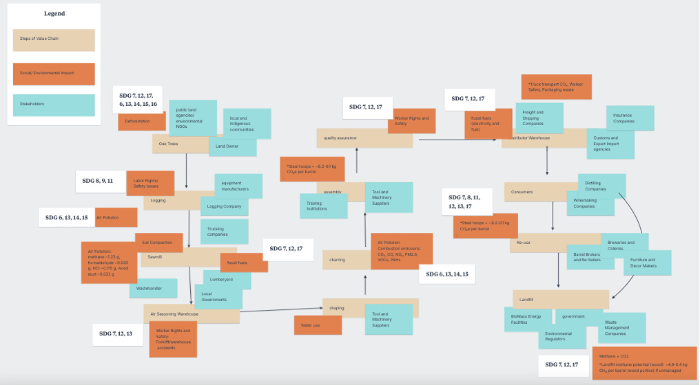

# Sustainability Strategy for Independent Stave Company (ISC)

## Overview
Developed a sustainability and business strategy for Independent Stave Company (ISC), a global manufacturer of oak barrels for the wine and spirits industry.

The project focused on identifying key environmental and operational risks and redesigning ISC’s business model to improve long-term sustainability, efficiency, and profitability.

---

## Key Outcome
- Designed a circular **“Barrels-as-a-Service”** model to extend product lifecycle and create recurring revenue  
- Identified major emissions drivers across operations (steel, transport, kiln drying)  
- Proposed solutions with potential to significantly reduce carbon impact and resource use  
- Aligned sustainability initiatives with long-term business value  

---

## Problem
ISC operates in a resource-intensive industry with several structural challenges:

- Dependence on white oak, which takes decades to mature  
- Carbon-intensive production processes  
- Limited lifecycle control after barrels are sold  
- Increasing pressure for sustainability transparency and reporting  

---

## Approach
- Analyzed ISC’s value chain, sustainability practices, and risk exposure  
- Built SDG impact and system-level frameworks to identify leverage points  
- Evaluated environmental, operational, and regulatory risks (PESTLE analysis)  
- Developed strategic and operational recommendations  

---

## Strategic Recommendations

### 1. Barrels-as-a-Service (Circular Model)
Shift from a one-time sales model to a leasing system where ISC retains ownership and manages the full lifecycle of barrels.

**Impact:**
- Extends product lifespan  
- Reduces demand for new raw materials  
- Creates recurring revenue streams  

---

### 2. Recycled Steel Adoption
Transition to recycled steel for barrel hoops.

**Impact:**
- Reduces emissions from one of the largest carbon sources in production  
- Improves overall carbon efficiency  

---

### 3. Durability Enhancements (Greenkote Coating)
Improve barrel longevity through protective coatings and design improvements.

**Impact:**
- Reduces replacement frequency  
- Lowers lifecycle emissions  
- Supports circular model viability  

---

## Business Impact
- Reduced reliance on volatile raw materials  
- Improved supply chain resilience  
- Created a more stable, recurring revenue model  
- Positioned sustainability as a competitive advantage  

---

## Key Visuals

---

## Deliverables
- 📄 Full Report: `/report/ISC_Sustainability_Report.pdf`  
- 📊 Strategy Presentation: `/presentation/ISC_Sustainability_Strategy.pdf`  

---

## Context
Graduate consulting project – Thunderbird School of Global Management  

---

## Authors
- Aimee Hopkins
- Brenna Wojtysiak
- Collin Breischaft
- Elle Whiteman
- Kartik Nariya
- Nokuthaba Tshuma
- Wasil Ahmad
 
